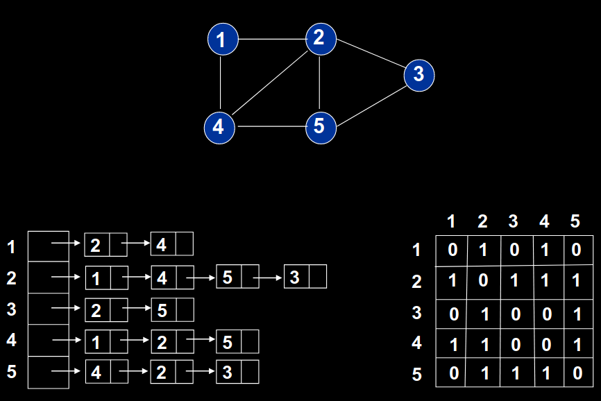

# Link-State Calculator

Link-State Algorithm calculator, with React graphical interface (and maybe D3 coming soon...).

Just for academic purpose...

UI: React

Enviorment Webpack + Babel

## Link-State Algorithm

N: Set of nodes.

D(v): Lower cost from the source node to the destination **v** of the current iteration.

p(v): Previous node (neighbor of **v**) in the current lowest cost path from source to **v**.

c(w,v): It is cost from **w** to **v**, where **w** and **v** are neighbors.

N': subset of nodes; **v** is in N 'if the least cost path from the origin to **v** is definitely known.

```
Init:
    N' = {u}
    For all nodes v
        If v is a neighbor of u
            Then D (v) = infinite

Repeat:
    Find w which is not in N 'such that D (w) is a minimum
    Add w to N'
    Update D (v) for each neighbor v of w and do not be in N ':
        D(v) = min( D(v), D(w) + c(w,v) )

Until N' = N
```

## Link-State Algoritmo

N: Conjunto de nodos.

D(v): Menor costo desde el nodo de origen hasta el destino **v** de la iteración actual.

p(v): Nodo anterior (vecino de **v**) en la ruta de menor costo actual desde el origen hasta **v**.

c(w,v): Es costo desde **w** a **v**, donde **w** y **v** son vecinos.

N': subconjunto de nodos; **v** está en N' si la ruta de menor costo desde el origen hasta **v** es definitivamente conocida.

```
Inicializamos:
    N' = {u}
    Para todos los nodos v
        Si v es un vecino de u
            Entonces D(v) = infinito

Repetir:
    Encontrar w que no esté en N' tal que D(w) es un mínimo
    Añadir w a N'
    Actualizar D(v) para cada vecino v de w y no esté en N':
        D(v) = min( D(v), D(w) + c(w,v) )

Hasta N' = N
```


## Graphs

Represent Nodes directions with a matrix, where **w** to **v** [w][v] and the content is the cost.

## Grafos

Representar las direcciones de los Nodos con una matriz, donde de **w** a **v** [w][v] y el contenido es el costo.

